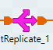

# Components

|Componente|Descricao
|---|---|
||Conversao por tipo, parece um pouco o tJavaRow, mas sem usar codigo Java. Usei o auto cast.
||
||Cria uma ou mais linhas com valores fiaxoss nas colunas
||Aplica um algorítimo java por linha (??). No exemplo fazia uma conversao de inteiro para string.
||Log de exibição dos registros
||Permite fazer mapeamento, tipo, uma seleção de saida.  Permite multiplas saidas, cada um com um schema diferente se necessario.
||Reorganiza os dados de forma e remover redundancias
||Replicas, copias dos registros
||Ordenação dos registros
||Quebra colunas em linhas. Ex>  Linha1 -> ABCD para Linha 1: AB e Linha 2: CD

## Observações

### Tmap

Quando você faz uma junção explícita no tMap, você pode definir um Match Model.

Ele tem diferentes opções:

1. Unique Match(Correspondência única):
    - funciona com junção interna e junção externa esquerda
    - seleção padrão
    - apenas a última correspondência passada para a saída = outras correspondências serão ignoradas

2. First Match (Primeira correspondência):
    - funciona com junção interna e junção externa esquerda
    - implica múltiplas correspondências esperadas na pesquisa
    - apenas a primeira correspondência passada para a saída = outras correspondências serão ignoradas

3. All Matches (Todas as correspondências):
    - funciona com junção interna e junção externa esquerda
    - implica múltiplas correspondências esperadas na pesquisa
    - todas as correspondências passadas para a saída = nenhuma correspondência ignorada

4. All Rows (Todas as linhas):
    - não funciona com junção interna e junção externa esquerda
    - cria uma junção cruzada entre a entrada principal e a(s) pesquisa(s)

### Normalizar (tNormalized)

Normalizar é o processo de reorganizar os dados em uma estrutura mais eficiente, eliminando a redundância e melhorando a integridade dos dados. Isso envolve:

Dividir os dados em tabelas ou conjuntos de dados menores, cada um com uma chave única.
Remover dados redundantes e inconsistentes.
Estabelecer relacionamentos entre as tabelas ou conjuntos de dados.
Normalizar ajuda a:

Reduzir a redundância de dados
Melhorar a integridade dos dados
Facilitar a manutenção e atualização dos dados

Exemplo: Em um banco de dados de clientes, você pode ter uma tabela com os seguintes campos: Nome, Endereço, Telefone e E-mail. Ao normalizar, você pode criar duas tabelas: Clientes com Nome e Endereço, e Contatos com Telefone e E-mail, relacionadas pela chave Cliente_ID.

### Denormalizar (tDenormalizedSortedRow e tDenormalizedRow)

Denormalizar é o processo de reorganizar os dados em uma estrutura mais simples, sacrificando a integridade dos dados em favor da performance e velocidade de acesso. Isso envolve:

Combinar dados de várias tabelas ou conjuntos de dados em uma única tabela ou conjunto de dados.
Replicar dados para evitar consultas complexas.
Denormalizar ajuda a:

Melhorar a performance de consultas
Reduzir a complexidade de consultas
Aumentar a velocidade de acesso aos dados
Exemplo: Em um banco de dados de e-commerce, você pode ter uma tabela com os seguintes campos: Produto, Preço, Descrição e Imagem. Ao denormalizar, você pode criar uma tabela com todos os campos, incluindo a imagem, para evitar consultas complexas e melhorar a performance.

Em resumo:

Normalizar é usado para melhorar a integridade e reduzir a redundância de dados, mas pode afetar a performance.
Denormalizar é usado para melhorar a performance e velocidade de acesso, mas pode afetar a integridade dos dados.
A escolha entre normalizar e denormalizar depende do objetivo do projeto, do tipo de dados e das necessidades de performance e integridade.