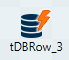

## Melhores práticas de desenvolvimento Talend

- Data flow = horizontal (esquerda para direita)
- Trigger = vertical (de cima para baixo)
- descriptive names
- camelCaseNames
- use existing fields for documentation - Descrição e Propósito
- create directory structure for input, output, params, logs
- define naming conventions
- structure the repository
- use versioning
- use template jobs = with pre/post/logging/context/etc.


Documentation in Talend:
- Subjob Title
- Component View Tab
- Note component
- Doc in repo
- Business Model in Repo
- Export job doc
- Document properties of job
good example? = this job (-;


## Build

Passando parametro na execução fora do Talend:
```powershell
# chamada powershell
a_deployment_run.ps1 --context_param noRows=6
```


## Components

Componente de fundo verde é o ínicio.


|Componente|Descricao
|---|---|
||É um Checksum, CRC (Cyclic Redundancy Check) é um algoritmo usado para verificar a integridade dos dados durante a transferência ou armazenamento.
||é usado para realizar testes e verificações dentro de um job. Ele permite validar condições específicas e emitir mensagens caso essas condições não sejam atendidas. É útil para testes automatizados e validação de dados dentro do fluxo de ETL.
||Junto com o tAssert, captura falhas e pode gerar logs ou relatórios.<br>- pode Unico catcher que não pode ser configurado pela ABA job/Stats&Log.
||Salva um dataset na memoria. Cada schema vai para uma memoria. No caso se houver mais de um buffer, os dados irão para a mesma memoria caso tenha o mesmo schema, do contrário, irão para memórias diferentes.
||Cria uma tabela no BD
||Conversao por tipo, parece um pouco o tJavaRow, mas sem usar codigo Java.<br>Usei o auto cast.
|<br>|Calcula o tempo de processamento. Um colocado no PreJob e outro no PostJob
||
||**Executa um comando SQL**
||Aciona uma Store Procedure. <br>No exemplo visto, fiz uma leitura de uma Store Procedure para uma varaivel local.
||Gera log de erro e pode parar a execução do job
||Cria e Carrega arquivo TXT
||Cria arquivo TXT
||Carrega arquivo TXT
|| SCD - Slowly Change Dimensions<br>Reflete mudanças no BD em tabelas de Dimensão
||Determina a tabela de origem para o tELTMap
||Uma espécie de Lookup e tMap com BD. Permitiu criar uma chamada recursiva (sql hierarquica)
||Determina a tabela de saida do tELTMap
||Permite tranformar um json em um dataset
||Exibe um lista de arquivos. Responde por pesquisas como __*.txt__
||Verifica se um arquivo existe. Saída IF.
||Le um arquivo de parametros/propriedades como variaveis de ambiente
||Captura propriedades de um arquivo (tamanho, data, address, etc)
||Faz o touch do linux, gera um arquivo sem conteúdo
||Cria uma ou mais linhas com valores fixados nas colunas.<br>Gera um fluxo de dados a partir de varíaveis.
||Medidor de vazão, captura o volume de dados que passa por uma conexão
||Em conjunto com o tFlowMeter, captura as informações do medidos de vazão e os apresenta em logs ou relatórios.<br>- pode ser omitido se configurado pela ABA job/Stats&Log
||Converte um fluxo de dados em iteração.<br>**Permite jogar key/value como global variable.**
||Loop de elementos de um conjunto.
||Loop por tempo (ex. a cada 2000 ms). Para parar somente com kill.
||Converte uma iteração em fluxo de dados
||Permite criar um codigo java com start, main e end
||Aplica um algorítimo java por linha (??).<br>No exemplo fazia uma conversao de inteiro para string.
||Em conjunto com o tWarn e tDie, captura os logs gerados e os apresentam em forma de logs ou relatórios.<br>- pode ser omitido se configurado pela ABA job/Stats&Log
||Log de exibição dos registros
||Um laço For. Define um start/finish e step
||Permite fazer mapeamento, tipo, uma seleção de saida. <br>Permite multiplas saidas, cada um com um schema diferente se necessario. <br>Usou essa expressao para gerar um sequence **Numeric.sequence("s1", 1, 1)**
||Usado para memorizar um certo numero de linhas e colunas de um dataset.<br>Observei que memorizou a ultima linha [fk]
||Reorganiza os dados de forma e remover redundancias
||Executa sempre, mesmo que o job possua erro ou nao.
||Replace definido diretamente no componente
||Replace oriundo de uma lista, usa um lookup
||Replicas, copias dos registros para n saídas
||Chamada Rest de um API
||Gerador de linhas
||Chama a execução de um job filho. Para retornar valor, a saida do filho deve ser de somente **UM** tBufferOutput.<br>- Usar o mesmo nome de variavel no contexto pai e filhos;<br>- Configurar o tRunJob para propagar todo o contexto para o filho;<br>- Para garantir o retorno, clicar em "Copy child job Schema". Pegara o schema do tBufferOutput
||Para ver uma amostra de registros (configuravel)
||Verificador de schema de um dataset
||Seta uma variavel global
||Provoca uma parada de tempo determinada
||Ordenação dos registros
||Executa um comando no terminal
||Quebra colunas em linhas.<br>Ex>  Linha1 -> ABCD para Linha 1: AB e Linha 2: CD
||Captura os logs de execuções gerais de uma job ou de um componente específico e os transformam em logs ou relatórios. <br>- Precisa habilitar na aba Components/Advanced Settings/tStatCatcher Statistics do componente para habilitar a captura;<br>- pode ser omitido se configurado pela ABA job/Stats&Log
||Unifica duas origens. Não unifica dados de processos paralelos. Precisam ter o mesmo Schema.
||Remove duplicidades no dataset. Precisa definir quais colunas nao tolera a duplicidade.
||Aguarda até que um arquivo apareca. Tem limites de tempo e numero de tentativas.
||Gera log de Warn

## Observações

### Funções Talend 

- Gera uma _sequence_: `Numeric.sequence("s1",1,1)` 


#### String
- Gera uma chave randomica de tamanho 6 formato ASCII: `TalendString.getAsciiRandomString(6)` 


#### Datetime
- Data/Hora atual com formatação em string: `TalendDate.formatDate("yyyy.MM.dd-HH.mm.ss",TalendDate.getCurrentDate())`


### Data Quality
- duplicate
- interval MAtch - lookup por range de dados
- replace
- redundancia
- fuzzy match
- schema check

### Tmap

Quando você faz uma junção explícita no tMap, você pode definir um Match Model.

Ele tem diferentes opções:

1. Unique Match(Correspondência única):
    - funciona com junção interna e junção externa esquerda
    - seleção padrão
    - apenas a última correspondência passada para a saída = outras correspondências serão ignoradas

2. First Match (Primeira correspondência):
    - funciona com junção interna e junção externa esquerda
    - implica múltiplas correspondências esperadas na pesquisa
    - apenas a primeira correspondência passada para a saída = outras correspondências serão ignoradas

3. All Matches (Todas as correspondências):
    - funciona com junção interna e junção externa esquerda
    - implica múltiplas correspondências esperadas na pesquisa
    - todas as correspondências passadas para a saída = nenhuma correspondência ignorada

4. All Rows (Todas as linhas):
    - não funciona com junção interna e junção externa esquerda
    - cria uma junção cruzada entre a entrada principal e a(s) pesquisa(s)

### SCDs
 Slowly Change Dimensions (Dimensão de mudança Lenta)

|Tipo|Indicação|Uso
|---|:-:|---|
|0|Fixo|Dados que nunca mudam (CPF, Data de Nascimento).
|1|Mutável|Dados que podem ser atualizados diretamente (Nome, Telefone).
|2|Histórico|Dados que precisam de histórico (Salário, Cargo).
|3|Híbrido|Mudanças recentes dentro do mesmo registro.

Se estiver lidando com um Data Warehouse, geralmente os campos críticos são Tipo 2, pois manter histórico é essencial.

Vamos supor que você tenha uma tabela de clientes com as seguintes colunas:

|ID|Nome|Estado|Salário|Data_Início|Data_Fim
|---|---|---|---|---|---|
|1|Fabio|SP|5000|2024-01-01|NULL

Agora, a empresa decide mudar o salário de Fabio para 6000. Dependendo do tipo de campo configurado no `tDBSCD`, o comportamento será:

- Campo como Tipo 0 (Fixo): Se Salário for Tipo 0, nenhuma alteração acontece. O Talend ignora a atualização.
- Campo como Tipo 1 (Mutável): 
```
UPDATE clientes SET Salário = 6000 WHERE ID = 1;
```
- Campo como Tipo 2 (Histórico): Um novo registro é criado, e o antigo é marcado como inativo.
```
UPDATE clientes SET Data_Fim = '2024-02-16' WHERE ID = 1;
INSERT INTO clientes (ID, Nome, Estado, Salário, Data_Início, Data_Fim)
VALUES (2, 'Fabio', 'SP', 6000, '2024-02-16', NULL);
```
- Campo como Tipo 3 (Híbrido): O salário atual é mantido em uma coluna adicional, preservando o histórico no mesmo registro.
```
UPDATE clientes SET Salário_Anterior = Salário, Salário = 6000 WHERE ID = 1;
```

Exemplo de config no Talend.


### Normalizar (tNormalized)

Normalizar é o processo de reorganizar os dados em uma estrutura mais eficiente, eliminando a redundância e melhorando a integridade dos dados. Isso envolve:

Dividir os dados em tabelas ou conjuntos de dados menores, cada um com uma chave única.
Remover dados redundantes e inconsistentes.
Estabelecer relacionamentos entre as tabelas ou conjuntos de dados.
Normalizar ajuda a:

Reduzir a redundância de dados
Melhorar a integridade dos dados
Facilitar a manutenção e atualização dos dados

Exemplo: Em um banco de dados de clientes, você pode ter uma tabela com os seguintes campos: Nome, Endereço, Telefone e E-mail. Ao normalizar, você pode criar duas tabelas: Clientes com Nome e Endereço, e Contatos com Telefone e E-mail, relacionadas pela chave Cliente_ID.

### Denormalizar (tDenormalizedSortedRow e tDenormalizedRow)

Denormalizar é o processo de reorganizar os dados em uma estrutura mais simples, sacrificando a integridade dos dados em favor da performance e velocidade de acesso. Isso envolve:

Combinar dados de várias tabelas ou conjuntos de dados em uma única tabela ou conjunto de dados.
Replicar dados para evitar consultas complexas.
Denormalizar ajuda a:

Melhorar a performance de consultas
Reduzir a complexidade de consultas
Aumentar a velocidade de acesso aos dados
Exemplo: Em um banco de dados de e-commerce, você pode ter uma tabela com os seguintes campos: Produto, Preço, Descrição e Imagem. Ao denormalizar, você pode criar uma tabela com todos os campos, incluindo a imagem, para evitar consultas complexas e melhorar a performance.

Em resumo:

Normalizar é usado para melhorar a integridade e reduzir a redundância de dados, mas pode afetar a performance.
Denormalizar é usado para melhorar a performance e velocidade de acesso, mas pode afetar a integridade dos dados.
A escolha entre normalizar e denormalizar depende do objetivo do projeto, do tipo de dados e das necessidades de performance e integridade.